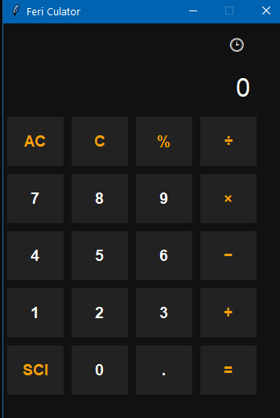
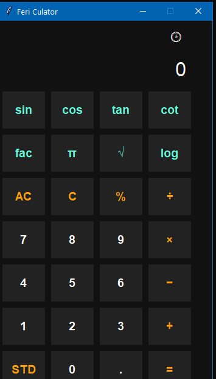
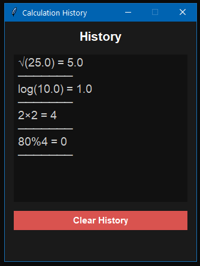

# FeriCulator

A desktop calculator application built with Python and tkinter, featuring standard and scientific modes, persistent history, and modular architecture.

## 🎯 Project Purpose

This project was created to practice and improve my understanding of:

* Object-Oriented Programming (OOP)
* GUI development with tkinter
* Modular project architecture
* JSON data storage
* Event-driven programming
* Error handling and validation
* Python project organization

## ✨ Features

### ✅ Implemented

* Standard calculator mode
* Scientific calculator mode
* Calculation history window
* Persistent history saved in JSON
* Dark-themed interface
* Error handling for invalid operations
* Dynamic switching between Standard and Scientific modes
* Modular code structure

### 🧠 Scientific Functions

* `sin`
* `cos`
* `tan`
* `cot`
* `sqrt`
* `log`
* `factorial`
* `π`

## 🛠 Technologies Used

* Python 3
* tkinter
* JSON
* datetime
* Object-Oriented Programming (OOP)


## 📸 Screenshots

### Standard Mode



### Scientific Mode



### History Window



## 📖 Skills Practiced

Through this project, I practiced:

* Building desktop applications with tkinter
* Designing graphical user interfaces
* Working with JSON files for persistent storage
* Structuring Python projects into modules
* Implementing OOP concepts in real projects
* Handling user input and exceptions
* Managing application state and history

## 🚀 How to Run

```bash
git clone https://github.com/FeriCodes/FeriCulator.git
cd FeriCulator
python main.py
```

## 📜 License

This project is licensed under the MIT License.

Made with ❤️ while learning Python development.
